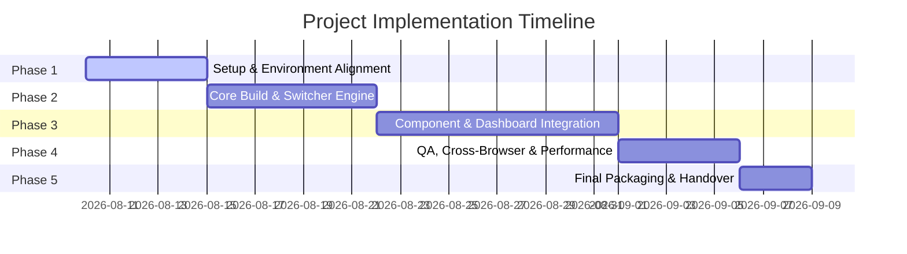

# STATEMENT OF WORK (SOW)

**Project Name:** Sash – Bootstrap 5 Premium Admin & Dashboard Template  
**Document Reference:** SOW-SASH-BS5-2026-V1  
**Original Developer / Author:** Spruko Technologies Private Limited  
**Current Framework Version:** Bootstrap v5.3.2 | Template Version: V.13  
**Effective Date:** August 7, 2026  
**Document Status:** Final Draft  

---

## 1. Executive Summary

This Statement of Work (SOW) details the technical specifications, scope of work, deliverables, timeline, milestones, quality assurance criteria, and governance model for the setup, customization, and implementation of the **Sash – Bootstrap 5 Premium Admin & Dashboard Template**.

Sash is a state-of-the-art, responsive admin and dashboard template engineered with modern web standards, including Bootstrap 5.3.2, Sass (SCSS), modular HTML partials, Gulp 4 automation, and pure JavaScript (zero jQuery dependency). The project provides a versatile enterprise UI foundation featuring over 137+ pre-built HTML pages, dual directionality (LTR/RTL), dark/light theme engines, dynamic color customization switchers, and an extensive suite of data visualization and form processing components.

---

## 2. Project Scope & Objectives

### 2.1 Project Objectives
- Establish a production-ready, modular frontend web architecture built upon Bootstrap 5.3.2 and native JavaScript.
- Configure a Gulp 4 compilation pipeline facilitating seamless transition from source partials (`src/`) to production distribution bundles (`dist/`).
- Provide responsive design consistency across mobile, tablet, desktop, and large monitor viewports.
- Support comprehensive layout modes including LTR/RTL, Dark/Light mode, transparent themes, dynamic primary/background color pickers, and flexible navigation formats (Vertical, Horizontal, Icon Text, Closed Menu, Hover Submenu).

### 2.2 In-Scope Activities
1. **Environment & Build Pipeline Setup:**
   - NPM dependency installation and build tool configuration.
   - Gulp task automation setup for SCSS compilation, HTML partial inclusion, CSS minification, JavaScript uglification, Autoprefixer, and BrowserSync.
2. **Core Theme & Switcher Customization:**
   - Configuration of the Sash Theme Switcher script and CSS variables.
   - Custom branding integration (Logos, favicons, typography, custom color palette definition).
   - Validation of dual directionality (LTR and RTL) layout behavior.
3. **Module & Page Integration (137+ Templates):**
   - **Dashboards:** Main Analytics, Sales, CRM, Ecommerce, and System Dashboards.
   - **Apps & Workflows:** Mail (Inbox, Read, Settings), Chat, File Manager (List, Details), To-Do List, Contacts, Full Calendar.
   - **Ecommerce Suite:** Products, Product Details, Add/Edit Products, Cart, Checkout, Orders, Order Details, Invoice (Create, List, Details), Reviews, Wishlist.
   - **Authentication & Security:** Sign In, Sign Up, Forgot Password, Reset Password, Lock Screen, Two-Step Verification, 400/401/403/404/500/503 Error Pages.
   - **Content & General Pages:** User Profile, Gallery, Timeline (v1 & v2), Pricing Tables, Team, Blog (List, Details, Create), FAQ, About Us, Terms & Conditions, Maintenance, Coming Soon.
   - **UI Components & Elements:** Accordions, Alerts, Badges, Buttons, Cards, Carousels, Dropdowns, Modals, Navbars, Offcanvas, Pagination, Popovers, Progress Bars, Spinners, Toasts, Tooltips, Typography.
   - **Form Controls & Editors:** Standard Inputs, Select2, Choices.js, Flatpickr, Pickr Color Picker, Input Masks, Range Sliders, Quill Rich Text Editor, FilePond, Dropzone File Uploads.
   - **Tables & Data Visualization:** DataTables, Grid.js Tables, ApexCharts, Chart.js, ECharts, Leaflet Maps, jsVectorMap, Google Maps.
4. **Cross-Browser & Performance Optimization:**
   - CSS/JS asset bundle minification and tree-shaking where applicable.
   - W3C markup compliance testing and cross-browser visual verification.

### 2.3 Out-of-Scope Activities
- Development of backend application code (e.g., Node.js, Python, PHP, Java server logic).
- Database schema design, hosting infrastructure, server administration, or CI/CD cloud pipeline setup.
- Third-party API integration beyond static mockup JSON/JS hooks.
- Purchase of extended commercial licensing for proprietary third-party fonts or external non-bundled assets.

---

## 3. Technical Architecture & Stack Specifications

### 3.1 Technology Stack Matrix

| Layer | Technology / Library | Version | Description |
| :--- | :--- | :--- | :--- |
| **Core Framework** | Bootstrap | `v5.3.2` | Primary responsive grid and UI layout engine |
| **Styles Engine** | Sass / SCSS | `v1.52.1+` | Modular CSS preprocessor with CSS custom properties |
| **Scripting Engine** | Vanilla JavaScript | `ES6+` | Zero jQuery dependency; framework-agnostic JS |
| **Build Automation** | Gulp | `v4.0.2` | Task runner for compilation, minification, and bundling |
| **Development Server** | BrowserSync | `v2.27.10` | Live reloading local web server |
| **Data Visualization** | ApexCharts / Chart.js / Echarts | `v3.37.0` / `v3.8.0` / `v5.3.3` | Interactive charting suite |
| **Mapping Engines** | Leaflet / jsVectorMap / GMaps | `v1.8.0` / `v1.4.5` / `v0.4.25` | Interactive & vector maps integration |
| **Advanced Tables** | DataTables / Grid.js | `v1.12.1` / `v5.1.0` | High-performance tabular data presentation |
| **Form Components** | Choices.js / Flatpickr / Quill / FilePond | `v10.1.0` / `v4.6.13` / `v1.3.7` / `v4.30.4` | Rich input, date, rich-text, and file handling |
| **Calendar Engine** | FullCalendar | `v5.11.4` | Event calendar interface |

### 3.2 Repository Architecture

```
HTML-Admin-Dashboard-Bootstrap-Template/
├── Change-logs/
│   └── changelog_V.13.txt          # Version 13 update documentation
├── Dependencies.txt                # Complete dependency version inventory
├── Documentation/                  # Developer HTML documentation & guides
│   ├── assets/                     # Documentation assets
│   ├── folder-structure.html       # Architectural layout guide
│   ├── gulp.html                   # Gulp task reference
│   ├── html-structure.html         # Template HTML layout guide
│   └── index.html                  # Documentation home
├── HTML/                           # Main application repository
│   ├── dist/                       # Compiled production-ready output
│   │   ├── assets/                 # Compiled CSS, JS, Fonts, Images, Plugins
│   │   └── html/                   # Compiled standalone HTML pages
│   ├── src/                        # Source development directory
│   │   ├── assets/                 # Raw SCSS, custom JS scripts, images, fonts
│   │   └── html/                   # Source HTML templates & partials
│   ├── gulpfile.js                 # Gulp build script definitions
│   └── package.json                # Project dependencies & build scripts
├── README.md                       # Repository overview & licensing agreement
├── Readme-Legal.txt                # Copyright & DMCA compliance terms
└── SOW.md                          # Statement of Work (this document)
```

---

## 4. Deliverables & Acceptance Criteria

### 4.1 Key Project Deliverables

| Deliverable ID | Component Description | Target Location | Verification Method |
| :--- | :--- | :--- | :--- |
| **DEL-01** | Configured Gulp Build Environment | `HTML/package.json`, `gulpfile.js` | Executable `npm run build` command completing with zero errors |
| **DEL-02** | Source Architecture (`src/`) | `HTML/src/html/`, `HTML/src/assets/` | Structured modular HTML partials and organized SCSS directory |
| **DEL-03** | Production Assets Bundle (`dist/`) | `HTML/dist/` | Minified CSS/JS assets, vendor dependencies, compiled HTML pages |
| **DEL-04** | Switcher & Layout Engine | `HTML/src/assets/js/switcher.js` | Functional LTR/RTL toggle, Dark/Light modes, custom color pickers |
| **DEL-05** | Complete Page Suite (137+ Pages) | `HTML/dist/html/*.html` | Visual inspection across all dashboard, app, and UI component pages |
| **DEL-06** | Developer Documentation | `Documentation/` | Offline-accessible documentation for build commands & structure |

### 4.2 Quality Assurance & Acceptance Criteria
1. **Build Integrity:** `gulp build` or `npm run build` must compile cleanly without throwing SCSS syntax errors or JS bundling exceptions.
2. **Responsive Design Standard:** Pages must maintain structural integrity without horizontal scroll overflows across the following breakpoints:
   - Extra Small (`<576px`)
   - Small (`≥576px`)
   - Medium (`≥768px`)
   - Large (`≥992px`)
   - Extra Large (`≥1200px`)
   - Extra Extra Large (`≥1400px`)
3. **Cross-Browser Compatibility:** Full functionality and layout fidelity across Chromium-based browsers (Chrome, Edge, Brave), Mozilla Firefox, and Apple Safari (macOS/iOS).
4. **Performance Standard:** Clean JavaScript execution with zero unhandled browser console errors during navigation and component interactions.

---

## 5. Work Phasing & Project Milestones



### Milestone Schedule

| Milestone | Phase Name | Scope Summary | Duration |
| :--- | :--- | :--- | :--- |
| **M1** | Environment Setup | Clone repository, install Node.js modules, test local Gulp server. | Days 1–5 |
| **M2** | Architecture & Switcher Config | Set up SCSS variables, branding, logo integration, Dark/Light & LTR/RTL engine. | Days 6–12 |
| **M3** | Dashboard & Apps Customization | Integrate ApexCharts, DataTables, Form plugins, Ecommerce, CRM, and Mail views. | Days 13–22 |
| **M4** | QA & Cross-Browser Validation | Perform responsive testing, fix styling regressions, clean build output in `dist/`. | Days 23–27 |
| **M5** | Documentation & Handover | Deliver final code package, verify SOW compliance, final sign-off. | Days 28–30 |

---

## 6. Roles & Responsibilities (RACI Matrix)

*Legend: **R** = Responsible, **A** = Accountable, **C** = Consulted, **I** = Informed*

| Project Activity | Client / Stakeholder | Lead Frontend Engineer | QA Engineer | Spruko Tech (Vendor) |
| :--- | :---: | :---: | :---: | :---: |
| Business Requirements & Branding Assets | **A** | **R** | **I** | **I** |
| License Acquisition & Legal Compliance | **A** | **I** | **I** | **C** |
| Gulp & SCSS Build Pipeline Configuration | **I** | **R / A** | **C** | **I** |
| UI Component & Page Customization | **C** | **R / A** | **C** | **I** |
| Cross-Browser & Responsive QA Testing | **I** | **R** | **A** | **I** |
| Acceptance Sign-off & Production Deployment | **A** | **R** | **C** | **I** |

---

## 7. Legal, Copyright & DMCA Compliance

1. **Copyright Ownership:** The original codebase and template design are copyrighted works owned by **Spruko Technologies Private Limited**.
2. **License Compliance:** Usage of this Product requires a valid Standard or Extended License purchased via ThemeForest / Codecanyon / Spruko Technologies. Unauthorized redistribution, resale, or sublicensing is strictly prohibited under international copyright laws and treaties.
3. **DMCA Enforcement:** In accordance with the Digital Millennium Copyright Act (DMCA), unauthorized hosting, public distribution, or IP infringement will be subject to immediate takedown notices issued to hosting providers, domain registrars, payment gateways, and search engines.
4. **Third-Party Open-Source Assets:** All open-source plugins listed in `Dependencies.txt` (Bootstrap, ApexCharts, Leaflet, SweetAlert2, etc.) remain subject to their respective open-source licenses (MIT, Apache 2.0, BSD).

---

## 8. Risk Management & Governance

### 8.1 Project Assumptions
- Node.js (`v16+` or `v18+` LTS) and NPM are pre-installed on the development environment.
- The development team works exclusively within `HTML/src/` for source modifications and relies on Gulp tasks to generate `HTML/dist/`.
- Backend integrations will be handled as a separate effort using standard RESTful APIs or GraphQL endpoints connected to the UI.

### 8.2 Change Governance Procedure
Any modifications to the agreed scope outlined in this SOW (e.g., adding custom unlisted pages, custom backend connectors, or non-standard framework integrations) must adhere to the following Change Request (CR) process:
1. Submission of a written Change Request detailing proposed alterations.
2. Impact analysis evaluating timeline, cost, and technical feasibility.
3. Formal approval and updated SOW addendum signed by both Client and Technical Lead prior to execution.

---

## 9. Sign-off & Approval

By signing below, the authorized representatives of both parties acknowledge that they have read, understood, and agreed to the scope, deliverables, timeline, and terms specified in this Statement of Work.

| Client Representative | Technical Lead / Contractor |
| :--- | :--- |
| **Name:** ___________________________ | **Name:** ___________________________ |
| **Title:** __________________________ | **Title:** __________________________ |
| **Signature:** ______________________ | **Signature:** ______________________ |
| **Date:** ___________________________ | **Date:** ___________________________ |
